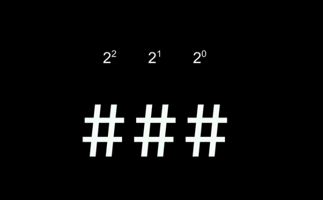
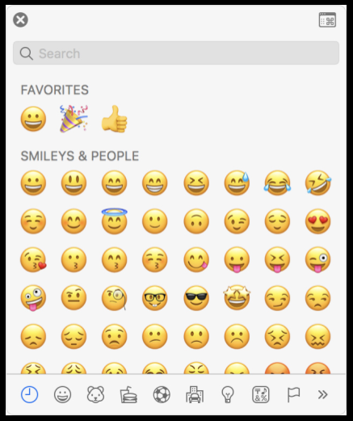

https://cs50.harvard.edu/x/2023/weeks/0/

# the key to success in programming in general is just to allow youself enough time.

#### This course is far more about you advancing “you” from “where you are today” than hitting some imagined standard.

## Computational Thinking

Essentially, computer programming is about taking some input and creating some output - thus solving a problem. What happens in between the input and output, what we could call a black box, is the focus of this course.

* unary / base-1 = one digit
* binary digit / base-2 = 0 or 1 
* decimal system = 0,1,2,3,4,5,6,7,8,9
* bit = 0 or 1 
* byte = 8 bit
* 11111111 = 255

## Text
ASCII
American Standard Code for Information Interchange

  H   I   !

  72  73  33

## Emojis
Since there were not enough digits in binary to represent all the various characters that could be represented by humans, the Unicode standard expanded the number of bits that can be transmitted and understood by computers. ( Unicode)
 

## Algorithms
Problem-solving is central to computer science and computer programming.

## Pseudocode and the Basic Building Blocks of Programming
The ability to create pseudocode is central to one’s success in both this class and in computer programming.

Pseudocode is a human-readable version of your code. For example, considering the third algorithm above, we could compose pseudocode as follows:

Pseudocoding is such an important skill for at least two reasons. 
* First, when you pseudocode before you create formal code, it allows you to think through the logic of your problem in advance.
* Second, when you pseudocode, you can later provide this information to others that are seeking to understand your coding decisions and how your code works.

Third, notice how there are expressions that can be stated as true or false, such as “person is earlier in the book.” We call these boolean expressions.

Finally, notice how these statements like “go back to line 3.” We call these loops.

## Summing Up
In this lesson, you learned how this course sits in the wide world of computer science and programming. You learned…

* Few students come to this class with prior coding experience!
* You are not alone! You are part of a community.
* Problem solving is the essence of the work of computer scientists.
* This course is not simply about programming – this course will introduce you to a new way of learning that you can apply to almost every area of life.
* How numbers, text, images, music, and video are understood by computers.
* The fundamental programming skill of pseudocoding.
* How abstraction will play a role in your future work in this course.
* The basic building blocks of programming, including functions, conditionals, loops, and variables.
* How to build a project in Scratch.